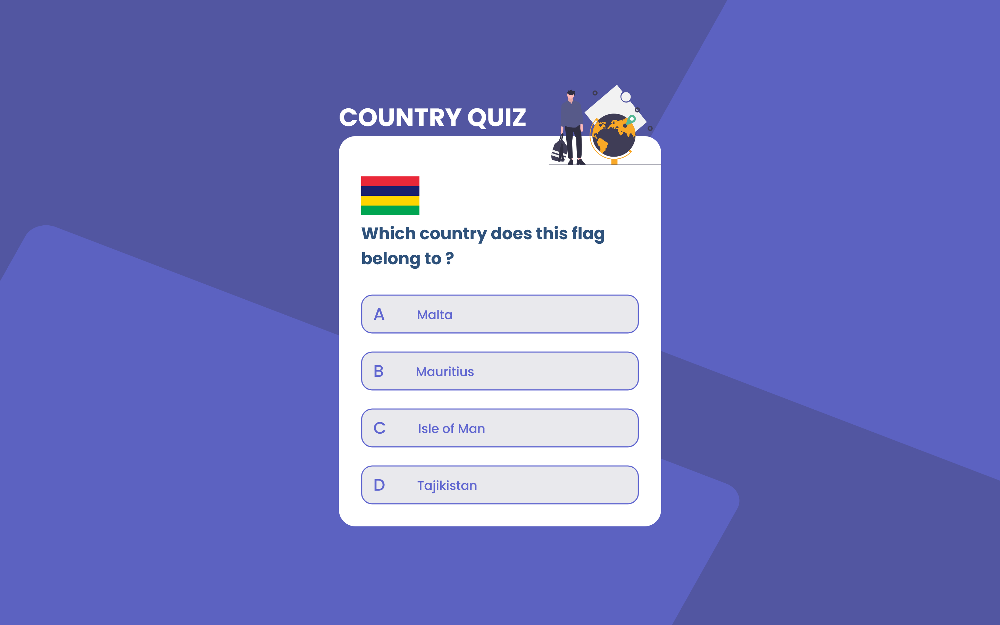
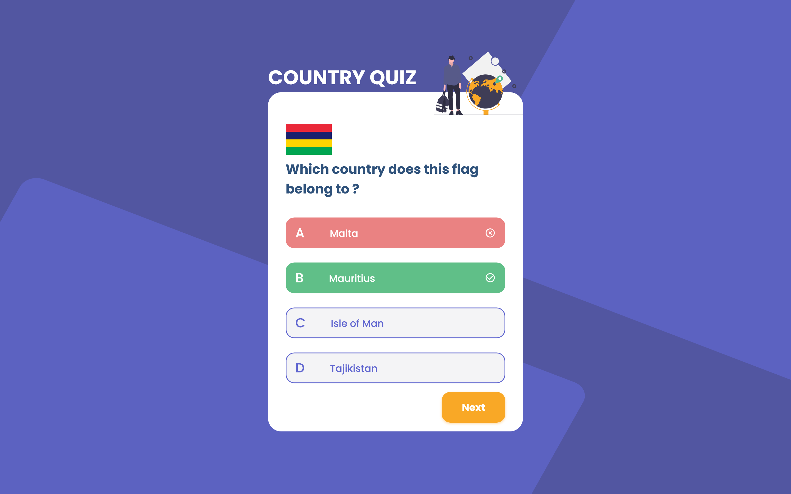

<!-- Please update value in the {}  -->

<h1 align="center">Country Quiz</h1>

   Solution for a challenge from  <a href="http://devchallenges.io" target="_blank">Devchallenges.io</a>.

  <h3>
    <a href="https://{your-demo-link.your-domain}">
      Demo
    </a>
     | 
    <a href="https://github.com/Thiago-a1/country-quiz">
      Solution
    </a>
     | 
    <a href="https://devchallenges.io/challenges/Bu3G2irnaXmfwQ8sZkw8">
      Challenge
    </a>
  </h3>

<!-- TABLE OF CONTENTS -->

## Table of Contents

- [Overview](#overview)
  - [Built With](#built-with)
- [Features](#features)
- [Contact](#contact)
- [Acknowledgements](#acknowledgements)

<!-- OVERVIEW -->

## Overview

### Built With

<!-- This section should list any major frameworks that you built your project using. Here are a few examples.-->

- [React](https://reactjs.org/)
- [Vite](https://vitejs.dev/)
- [Styled-Components](https://styled-components.com/)

## Acknowledgements

<!-- This section should list any articles or add-ons/plugins that helps you to complete the project. This is optional but it will help you in the future. For example: -->

- [Steps to replicate a design with only HTML and CSS](https://devchallenges-blogs.web.app/how-to-replicate-design/)
- [Node.js](https://nodejs.org/)

## Contact

- Website [your-website.com](https://{your-web-site-link})
- GitHub [@Thiago-a1](https://github.com/Thiago-a1)
